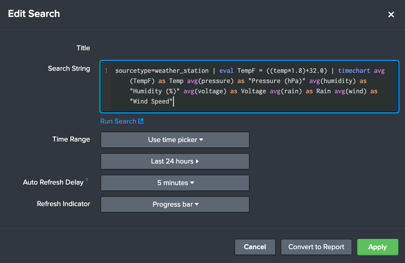
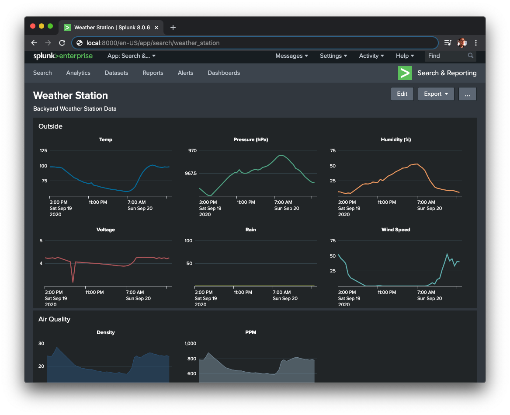

# TinySplunk - Examples

TinySplunk is a collection of tools to build and use a Docker containerized version of Splunk for home and educational use.

## Example - Weather Station Data

I created a solar powered  WiFi weather station that sends temperate, pressure, humidity and other data. I packaged this data into a JSON payload and send it with [HEC-JSON-Sender.py](../tools/HEC-JSON-Sender.py) to Splunk.  

```json
{"pressure": 966.44, "voltage": 4.23, "wind": 47.0, "temp": 36.4, "sensor": "102", "rain": "0", "humidity": 5.32}
```

### Splunk Query

```sql
ourcetype=weather_station 
| eval TempF = ((temp*1.8)+32.0) 
| timechart avg(TempF) as "Temp" avg(pressure) as "Pressure (hPa)" avg(humidity) as "Humidity (%)" avg(voltage) as "Voltage" avg(rain) as "Rain" avg(wind) as "Wind Speed"
```

### Splunk Dashboard




